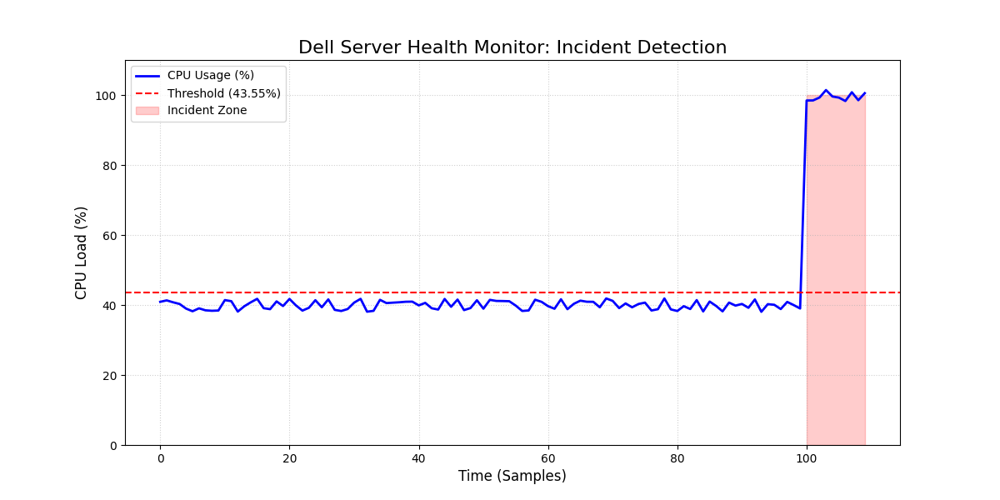

# DellGuard: AI-Driven Infrastructure Safety System 🚀

**DellGuard** is an automated monitoring and safety system designed to protect server infrastructure during software deployments. It uses statistical analysis to detect anomalies and local AI to provide real-time incident diagnostics.

## 🌟 Key Features
* **3-Sigma Statistical Monitoring**: Automatically calculates healthy performance baselines and sets dynamic thresholds.
* **AI Incident Diagnosis**: Integrated with **Llama 3 (via Ollama)** to analyze telemetry data and provide human-readable root cause reports.
* **Automated Rollback Logic**: Instantly triggers safety protocols when critical thresholds are breached.
* **Data Visualization**: Generates performance charts (`server_health_chart.png`) for post-incident review.
* **Professional Logging**: Maintains a detailed `incidents.log` with AI-generated insights.

## 🛠 Tech Stack
* **Language:** Python 3.x
* **Data Analysis:** Pandas, NumPy
* **AI Engine:** Ollama / Llama 3 (8B)
* **Visualization:** Matplotlib

## 📊 How It Works
1. **Baseline Creation**: The system reads historical data from `server_metrics.csv`.
2. **Real-time Monitoring**: The `guard.py` module tracks live CPU usage.
3. **Anomaly Detection**: If CPU usage exceeds the 3-Sigma threshold, an alert is triggered.
4. **AI Verdict**: The system sends a telemetry snapshot to the local Llama 3 model for analysis.
5. **Visualization**: A visual report is generated to show exactly where the spike occurred.

## 📸 System in Action

## 📋 Example AI Diagnosis (from incidents.log)
> "The most likely cause of the rollback is CPU utilization exceeding the threshold (100.30% vs 43.55%). This indicates a critical resource exhaustion, possibly due to a runaway process."

## 🚀 Future Roadmap
- [ ] **Multi-Metric Analysis**: Correlation between RAM, CPU, and Latency.
- [ ] **Slack/Telegram Notifications**: Real-time alerts for SRE engineers.
- [ ] **Predictive Guard**: Trend analysis to predict failures before they happen.
